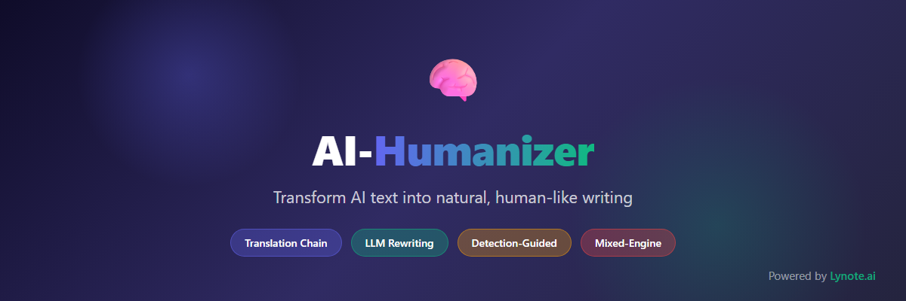

<div align="center">

# Lynote Humanize Text

**将 AI 生成文本改写为自然人类文风的开源管线**

[](https://www.producthunt.com/products/lynote-ai?launch=lynote-3)

[](https://github.com/lynote-ai/humanize-text/stargazers)
[](LICENSE)
[](https://www.python.org/)
[](https://github.com/lynote-ai/humanize-text/commits)
[](https://huggingface.co/spaces/Lynote/free-ai-detector)

[官网](https://lynote.ai) · [Product Hunt](https://www.producthunt.com/products/lynote-ai?launch=lynote-3) · [体验检测器](https://github.com/lynote-ai/ai-text-detector) · [Discord](https://discord.gg/NzcH5DYzBj) · [X](https://x.com/lynote_ai)
<br/>
  

<p align="center">
  
</p>


<p align="center">
  <a href="README.md">English</a> | 中文
</p>

</div>

---

大多数"拟人化"工具都是黑盒,外面贴满营销话术。这个项目是开源的,你可以直接读它到底做了什么。

真正有意思的不是 LLM 改写——那人人都在做。而是这条**翻译链**。

## 工作原理

### 逐步管线

| 步骤 | 引擎 | 转换方向 | 目的 |
|------|------|---------|------|
| 1 | LLM (温度 1.3) | 输入 → 中文（中文改写） | LLM 拟人化改写 + 语言转换 |
| 2 | LLM (温度 1.3) | 中文 → 日语（日语改写） | 二次 LLM 拟人化,携带步骤 1 历史 |
| 3 | 谷歌翻译 | 日语 → 芬兰语（一轮翻译） | 第一次翻译,远距离语种结构扰动 |
| 4 | 小牛翻译 | 芬兰语 → 英语（二轮翻译） | 第二次翻译,跨引擎重构 |

### 为什么这条链路有效

1. **步骤 1–2（LLM 改写）:** 可配置的 LLM 提供商（默认 DeepSeek,可选 OpenRouter）在温度 1.3 下边翻译边改写,通过创造性变化打破 AI 统计指纹。步骤 2 携带步骤 1 作为对话历史,保证连贯的拟人化效果。
2. **步骤 3–4（多引擎翻译）:** 两个不同 NMT 引擎（谷歌 → 小牛）引入叠加的结构变化,任何单引擎指纹都无法存活。
3. **远距离语种:** 中文 → 日语 → 芬兰语,每一跳都最大化语言距离,确保在重构回英语前完成彻底的结构重组。

## 快速开始

```bash
git clone https://github.com/lynote-ai/humanize-text.git
cd humanize-text
pip install -r requirements.txt
cp config/config.example.toml config/config.toml   # 填入你的 API Key
python -m src.standard.pipeline --input draft.txt
```

## 层级 Tiers

| 层级 | 作用 | 适合 |
|---|---|---|
| `standard` | 2 次 LLM 改写 + 2 次翻译跳转 | 默认平衡 |
| `advanced` | 额外多轮 LLM 重写 | 更深度重构 |
| `focus` | 额外检测引导反馈循环 | 最大程度重构 |


**使用须知。** 本工具用于提升 AI 辅助草稿的可读性与自然语感。如果你在学术场景写作,请遵守所在机构关于 AI 使用与披露的规定。

> **重要:** 检测器分数是概率性的。本项目不保证改写后的文本会被判定为人类撰写,也不应被用于伪造作者身份或规避机构政策。

> **本仓库的定位。** 这里的管线是我们团队 2026 年初的公开探索 —— 是我们**当时**找到的最有效方案,开源出来供任何人阅读、运行和二次开发。此后我们已远远超越了它: Lynote.ai 现在运行的是**我们自研的检测 + 拟人化模型**,基于精选高质量数据集做对抗训练。
>
> **相较本仓库的开源链路,当前 Lynote.ai 拟人化引擎的检测器绕过率提升约 30%、输出质量相对提升约 50% —— 两者都是相对本链路的提升。** 检测侧吸收了"人类写作与 AI 写作到底差在哪"的最新研究 —— 差别不在表层风格,而在篇章级的*叙事*结构（如 **[StoryScope](docs/research-notes.md)** 研究,UMD 与 Google DeepMind,COLM 2026）。只做风格层改写已经不够 —— 这正是这条开源链路存在天花板的原因。
>
> **本仓库仍是一个忠实、可运行的参考实现。想要当前最佳效果,请试用 [Lynote.ai](https://lynote.ai)。**

---

## Lynote.ai — 超越 Standard

<p align="center">
  <a href="https://lynote.ai/ai-humanizer">
    
  </a>
</p>

上面的 Standard 管线只是**三个层级之一**,各有取舍:

| 层级 | 风格保留度 | 速度 | 方案 |
|------|-----------|------|------|
| **Standard**（本仓库） | 最好 | 快 | 翻译链 |
| **Advanced** | 良好 | 中等 | 翻译链 + LLM 多轮重写 |
| **Focus** | 一般 | 较慢 | 翻译链 + 检测引导反馈循环 |

**[Lynote.ai](https://lynote.ai)** 融合全部三个层级,自动为每段文本选择最优方案:

- **智能层级选择** — 分析文本,逐段选择 Standard、Advanced 或 Focus
- **自适应组合** — 可在同一文档内混合使用多个层级
- **支持 10+ 种语言** — 英语、中文、日语、韩语、西班牙语、法语、德语等
- **粘贴即用** — 无需部署,无需 API Key,无需配置

<p align="center">
  <a href="https://lynote.ai"></a>
</p>

---

## 三种运行方式

| 方式 | 适合人群 | 操作 |
|------|---------|------|
| Lynote.ai | 所有人 — 全层级,零部署 | 访问 [lynote.ai](https://lynote.ai) |
| n8n 工作流 | 无代码自动化用户 | 导入 [`n8n/humanize_standard.json`](n8n/humanize_standard.json) |
| Python 脚本 | 开发者 | 见下方 |

### Python

```bash
git clone https://github.com/lynote-ai/humanize-text.git
cd humanize-text
pip install -r requirements.txt
cp config/config.example.toml config/config.toml
# 在 config.toml 中填入 API 密钥（见下方示例）
python -m src.standard.pipeline --input "你的 AI 生成文本"
```

**DeepSeek（默认）：**

```toml
[api_keys]
deepseek_api_key = "sk-..."
niutrans_api_key = "your-key"

[llm]
provider = "deepseek"
```

**OpenRouter：**

```toml
[api_keys]
openrouter_api_key = "sk-or-..."
niutrans_api_key = "your-key"

[llm]
provider = "openrouter"
model = "deepseek/deepseek-chat"
```

**Atlas Cloud：**

```toml
[api_keys]
atlascloud_api_key = "ak-..."
niutrans_api_key = "your-key"

[llm]
provider = "atlascloud"
model = "qwen/qwen3.5-flash"
```

**OrcaRouter：**

```toml
[api_keys]
orcarouter_api_key = "sk-orca-..."
niutrans_api_key = "your-key"

[llm]
provider = "orcarouter"
model = "deepseek/deepseek-chat"
```

可通过 `[llm].base_url` 或环境变量 `LLM_BASE_URL` / `LLM_API_KEY` 覆盖 API 端点。完整说明见 [docs/configuration.md](docs/configuration.md)。

### n8n 工作流

1. 将 `n8n/humanize_standard.json` 导入你的 n8n 实例
2. 在 HTTP Request 节点中配置 LLM API Key 和 URL（默认为 DeepSeek；可改为 OpenRouter 的 `https://openrouter.ai/api/v1/chat/completions`）
3. 运行 — 输入文本,输出拟人化结果

---

## 真实样例展示 — 5 组完整中间步骤输出

我们在 5 段真实输入文本上端到端运行了管线,并保存了每一步的中间输出。在这些样本上,5 段最终输出都被我们测试的检测器判定为 `human`。这些是开源链路的示例轨迹,并非保证 —— 检测是概率性的,且随检测器和版本而变（见本文顶部说明）。

| # | 主题 | 检测结果 | 置信度 |
|---|------|---------|--------|
| [01](examples/showcase/example_01.md) | 量子计算 | `human` | 0.9997 |
| [02](examples/showcase/example_02.md) | 量子准备度战略 | `human` | 0.9982 |
| [03](examples/showcase/example_03.md) | 可持续供应链 | `human` | 0.7810 |
| [04](examples/showcase/example_04.md) | 财商教育 | `human` | 0.9924 |
| [05](examples/showcase/example_05.md) | 学术同行评议 | `human` | 0.7218 |

每个样例展示: 原始输入 → 步骤 1（中文改写）→ 步骤 2（日语改写）→ 步骤 3（一轮翻译）→ 步骤 4（二轮翻译,最终输出）。完整轨迹见 [`examples/showcase/`](examples/showcase/)。

---

## 质量指标

在 50 组文本对上经专家评估：

| 维度 | 评分（满分 10 分） |
|------|-------------------|
| 信息完整性 | 10.0 |
| 语言流畅度 | 9.0 |
| 风格适应性 | 8.8 |
| 可读性 | 9.2 |
| 创意与感染力 | 8.5 |
| **综合评分** | **9.1** |

- **关键信息保留率：** 100%（50/50 组）
- 所有文本均完整保留原文关键信息，无重大遗漏或意义扭曲

> 以上评分仅衡量**本仓库** Standard 管线的输出,是静态质量指标,并非顶部提到的 Lynote.ai 相对提升数据。

---

## 与其他层级对比

| | Standard（本仓库） | Lynote.ai |
|---|---|---|
| 可用层级 | 仅 Standard | Standard + Advanced + Focus |
| 层级选择 | 手动 | 逐段自动 |
| 风格保留度 | 最好 | 自适应 — 逐段取最优 |
| 部署 | Python + API Key | 零部署 |
| 适合 | 风格敏感内容 | 任意内容类型 |

---

## 文档

- [管线技术详解](docs/pipeline.md) — v1.5 生产管线
- [4 种方法论参考](docs/techniques.md) — v1.0 底层方法
- [研究笔记](docs/research-notes.md) — 为什么纯风格改写有天花板（StoryScope, COLM 2026）
- [配置指南](docs/configuration.md)
- [n8n 工作流指南](docs/n8n-guide.md)
- [Lynote.ai 与开源版对比](docs/lynote-comparison.md)
- [常见问题](docs/faq.md)

### 仓库结构

```
src/
├── standard/                # ★ v1.5.1 生产级 Standard 管线（推荐）
│   ├── pipeline.py          # 4 步链路,CLI 入口
│   ├── llm_client.py        # OpenAI 兼容客户端（DeepSeek / OpenRouter）
│   ├── llm_rewriter.py      # LLM 拟人化改写
│   └── translators.py       # 谷歌 + 小牛引擎
│
└── methodologies/           # v1.0 四方法论参考实现
    ├── humanizer.py         # v1.0 dispatcher + FastAPI 应用
    ├── translation_chain.py # 方法 1
    ├── llm_rewriter.py      # 方法 2
    ├── detection_pipeline.py# 方法 3
    ├── mixed_engine.py      # 方法 4
    ├── postprocess.py
    ├── detectors/           # 方法 3 检测器
    └── utils/

examples/
├── example_usage.py         # ★ v1.5.1 最小入口
├── showcase/                # ★ 5 组真实样本 + 中间步骤输出
└── legacy/                  # v1.0 示例 + 四方法对比输出
```

---
## 局限性

往返翻译会损失精度。技术术语和引用可能发生漂移,越深的层级会用更多原文风格换取更多重构。如果你处理的内容对措辞精确性要求很高,请仔细核对输出,不要盲信管线。

没有任何改写方法能让文本可靠地不被检出。检测器的更新速度快过管线,结果也随输入长度、主题以及你面对的具体检测器而变。请把 `showcase/` 的结果当作快照,而非保证。

## 相关

- [Lynote AI 检测器](https://lynote.ai/ai-detector) — 句子级评分,免费
- [Lynote AI 拟人化](https://lynote.ai/ai-humanizer) — 本管线的托管版本
- [Hugging Face Space](https://huggingface.co/spaces/Lynote/free-ai-detector) — 无需安装即可试用

## 开源协议

MIT License。详情见 [LICENSE](LICENSE)。

---

## 支持与联系
⭐ 国内 AtomGit 托管：https://atomgit.com/babydx/humanize-text

🌐 访问官网 [lynote.ai](https://lynote.ai) 解锁完整高级功能。

💬 有疑问、功能建议或使用问题?欢迎在 [Discussions](https://github.com/lynote-ai/humanize-text/discussions) 发起讨论。

