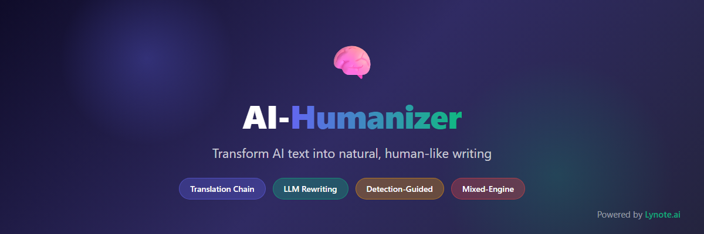
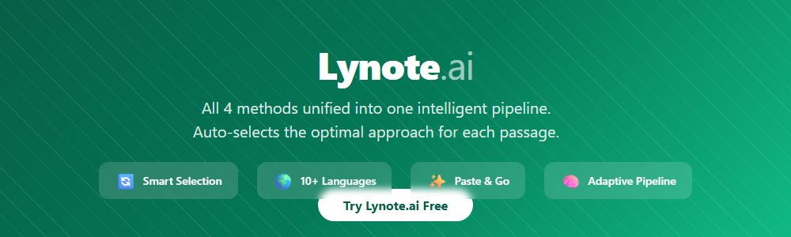

<p align="center">
  
</p>

<p align="center">
  <a href="https://github.com/lynote-ai/humanize-text/stargazers"></a>
  <a href="https://github.com/lynote-ai/humanize-text/network/members"></a>
  <a href="https://github.com/lynote-ai/humanize-text/blob/main/LICENSE"></a>
  <a href="https://www.python.org/"></a>
  <a href="https://lynote.ai"></a>
</p>

<p align="center">
  English | <a href="README-zh.md">中文</a>
</p>

---

## What is Humanize-Text?

A **production-ready** AI text humanization toolkit that transforms AI-generated text into natural, human-like writing through a multi-language translation chain. This is the actual working pipeline — not a demo.

### v1.5 — Standard Pipeline

The Standard pipeline preserves the original writing style while routing text through a 5-step multi-language chain with LLM-powered humanization at key stages.

```
Input (EN) → Chinese (LLM Rewrite) → Japanese (LLM Rewrite) → German (Google) → Spanish (Niutrans) → Target Language (Niutrans)
```

**Characteristics:**
- Best original style preservation among all approaches
- Fast processing speed
- 100% key information retention (verified on 50 text pairs)
- Expert quality score: 9.1/10

> **Want higher bypass rates + all methods combined?**
> [Lynote.ai](https://lynote.ai) fuses Standard + Advanced + Focus pipelines into one intelligent system — auto-selects the optimal approach for each passage.
>
> **[Try Lynote.ai Free →](https://lynote.ai)**

---

## How It Works

### Step-by-Step Pipeline

| Step | Engine | From → To | Purpose |
|------|--------|-----------|---------|
| 1 | DeepSeek (temp 1.3) | Input → Chinese | LLM humanization rewrite + language shift |
| 2 | DeepSeek (temp 1.3) | Chinese → Japanese | Second LLM humanization + distant language |
| 3 | Google Translate | Japanese → German | Machine translation structural disruption |
| 4 | Niutrans | German → Spanish | Cross-engine distribution shift |
| 5 | Niutrans | Spanish → Target Language | Final reconstruction to target |

### Why This Chain Works

1. **Steps 1–2 (LLM Rewrite):** DeepSeek at temperature 1.3 rewrites while translating, breaking AI statistical fingerprints with creative variation. Each step carries context from the previous round.
2. **Steps 3–5 (Multi-Engine Translation):** Three different NMT engines (Google → Niutrans → Niutrans) introduce compounding structural changes. No single-engine fingerprint survives.
3. **Distant Languages:** Chinese → Japanese → German → Spanish maximizes linguistic distance at each hop, ensuring thorough restructuring.

---

## Lynote.ai — Beyond Standard

<p align="center">
  <a href="https://lynote.ai">
    
  </a>
</p>

The Standard pipeline above is **one of three tiers** available. Each has different trade-offs:

| Tier | Style Preservation | Speed | Approach |
|------|-------------------|-------|----------|
| **Standard** (this repo) | Best | Fast | Translation chain |
| **Advanced** | Good | Medium | Translation chain + LLM multi-round rewriting |
| **Focus** | Moderate | Slower | Translation chain + Detection-guided feedback loop |

**[Lynote.ai](https://lynote.ai)** combines all three tiers and automatically selects the optimal approach for each text passage:

- **Intelligent Tier Selection** — Analyzes text and picks Standard, Advanced, or Focus per-passage
- **Adaptive Combination** — Can mix tiers within a single document
- **10+ Languages** — English, Chinese, Japanese, Korean, Spanish, French, German, and more
- **Paste & Go** — No setup, no API keys, no configuration

<p align="center">
  <a href="https://lynote.ai"></a>
</p>

---

## Quick Start

| Method | Who It's For | How |
|--------|-------------|-----|
| [Lynote.ai](https://lynote.ai) | Everyone — all tiers, zero setup | Visit [lynote.ai](https://lynote.ai) |
| n8n Workflow | No-code automation users | Import [`n8n/humanize_standard.json`](n8n/humanize_standard.json) |
| Python Script | Developers | See below |

### Python

```bash
git clone https://github.com/lynote-ai/humanize-text.git
cd humanize-text
pip install -r requirements.txt
cp config/config.example.toml config/config.toml
# Fill in your API keys in config.toml
python -m src.pipeline --input "Your AI-generated text here"
```

### n8n Workflow

1. Import `n8n/humanize_standard.json` into your n8n instance
2. Configure DeepSeek API key in the HTTP Request nodes
3. Run — input text goes in, humanized text comes out

---

## Quality Metrics

Tested on 50 text pairs with expert evaluation:

| Dimension | Score (out of 10) |
|-----------|-------------------|
| Information Completeness | 10.0 |
| Language Fluency | 9.0 |
| Style Adaptability | 8.8 |
| Readability | 9.2 |
| Creativity & Impact | 8.5 |
| **Overall** | **9.1** |

- **Key Information Retention:** 100% (50/50 pairs)
- All texts preserved original key information without distortion

---

## Comparison with Other Tiers

| | Standard (this repo) | Lynote.ai |
|---|---|---|
| Tiers Available | Standard only | Standard + Advanced + Focus |
| Tier Selection | Manual | Automatic per-passage |
| Style Preservation | Best | Adaptive — best possible per passage |
| Setup | Python + API keys | Zero setup |
| Best For | Style-sensitive content | Any content type |

---

## Documentation

- [Pipeline Technical Details](docs/pipeline.md)
- [Configuration Guide](docs/configuration.md)
- [n8n Workflow Guide](docs/n8n-guide.md)
- [FAQ](docs/faq.md)

---

## License

MIT License. See [LICENSE](LICENSE) for details.

---

## Links

- [Lynote.ai — AI Humanization Platform](https://lynote.ai)
- [Report a Bug](https://github.com/lynote-ai/humanize-text/issues)

### Recommended Projects

- [MoneyPrinterTurbo](https://github.com/harry0703/MoneyPrinterTurbo) — AI short video generator
- [AiToEarn](https://github.com/yikart/AiToEarn) — AI content publishing tool

---

## Star History

<p align="center">
  <a href="https://star-history.com/#lynote-ai/humanize-text&Date">
    
  </a>
</p>

---

<p align="center">
  <b>If this project helps you, please give it a ⭐!</b>
</p>
