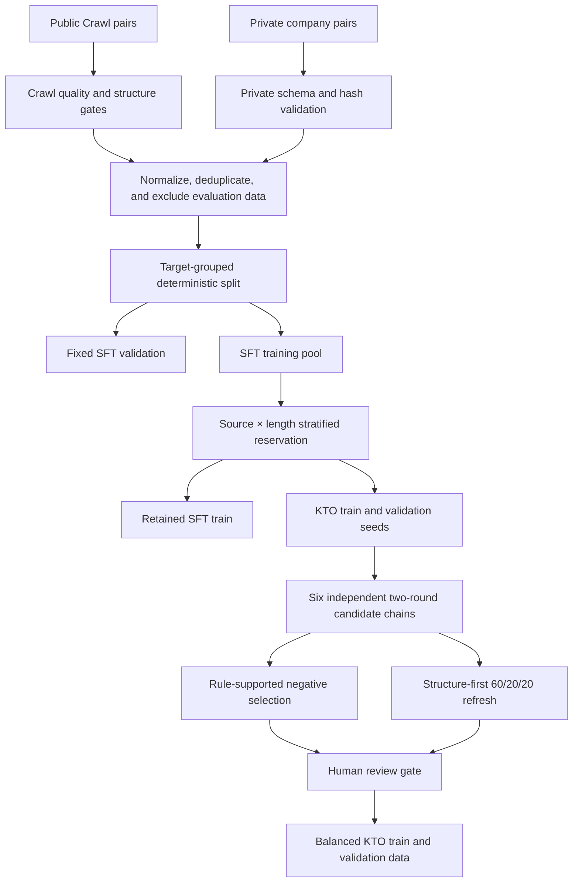

# Humanize KTO Data Pipeline

[Chinese](README.zh-CN.md)

Humanize KTO Data Pipeline is a deterministic data-construction system for AI-to-human rewriting. It builds SFT data, reserves disjoint KTO inputs, generates rewrite candidates, selects useful negative responses, and constructs a structure-first KTO dataset.

The repository publishes the implementation, policies, tests, and **exactly 50 demo records for each data stage**. Full datasets, model checkpoints, private endpoints, and internal paths are not included.

The training data has two sources: public open-source Crawl data and internal company data. Public artifacts refer to the internal source only as `private`; its internal dataset name and complete contents are not disclosed. The complete construction method is documented in [docs/DATA_CONSTRUCTION.md](docs/DATA_CONSTRUCTION.md).

## Pipeline



The important invariants are:

- reserved KTO inputs are removed from the SFT training split;
- the upstream SFT validation split remains unchanged;
- source, target, and pair identities are carried through SHA-256 fields;
- every KTO input has one desirable and one undesirable row;
- generated negatives pass explicit mechanical gates and still require human review;
- outputs are timestamped and registered in `manifest.yaml`.

See [docs/DATA_CONSTRUCTION.md](docs/DATA_CONSTRUCTION.md) for the full data methodology and [docs/ARCHITECTURE.md](docs/ARCHITECTURE.md) for the stage contracts and design decisions.

## Prompt diversity

System Prompts are intentionally public in this project. Instead of using one fixed instruction, the method first creates a pool of randomly worded Prompt variants that share the same task contract. During SFT dataset construction, one Prompt is pseudo-randomly sampled for each source-target pair with fixed seed `42`. The selected `system_prompt_id` is recorded so the assignment is reproducible, and later KTO stages preserve that Prompt.

This controlled variation is intended to reduce dependence on a single instruction wording and improve generalization to equivalent Prompt expressions. Only the surface wording varies; the rewriting objective, preservation rules, source text, target text, and split assignment stay unchanged.

Five representative System Prompt examples and the full rationale are provided in [docs/PROMPTS.md](docs/PROMPTS.md). The stage demo data retains its originally sampled Prompt values as part of record provenance.

## Repository layout

```text
code/data_process/     Ordered pipeline stages (a through f)
code/harness/          Manifest and public-demo validators
code/tests/            Unit tests for selection, validation, and metrics
configs/               Versioned reservation and negative-selection policies
data/demos/             Five public stages, exactly 50 JSONL records each
docs/                   Data, architecture, and Prompt methodology in both languages
tools/                  Maintainer-only bounded demo exporter
manifest.yaml           Reproducibility and artifact metadata
Makefile                Supported workflow entry points
```

## Quick start

Python 3.12 is recommended. The core pipeline requires PyYAML and tqdm; remote candidate generation additionally requires httpx and the OpenAI Python client.

```bash
conda create -n test python=3.12
conda run -n test pip install -r requirements.txt
make check
```

Outside this source workspace, you may use another environment by overriding the Make variable:

```bash
make check PYTHON=python
```

`make check` validates the project manifest, enforces the 50-record release limit, verifies every demo hash, requires exactly five distinct public Prompt examples, rejects unexpected demo JSONL files, checks bilingual-document links and Mermaid blocks, and runs the unit tests. Use `make help` for all supported commands.

## Public demo data

The release contains five stage-aligned demo files:

| Stage | File | Records |
|---|---|---:|
| Retained SFT | `data/demos/01_sft/sft_train_demo.jsonl` | 50 |
| Reservation seeds | `data/demos/02_reservation/kto_seed_demo.jsonl` | 50 |
| Generated candidates | `data/demos/03_generation/kto_candidates_demo.jsonl` | 50 |
| Selected KTO rows | `data/demos/04_negative_selection/kto_train_demo.jsonl` | 50 |
| Structure-first KTO rows | `data/demos/05_structure_refresh/kto_train_demo.jsonl` | 50 |

Their hashes and record counts are pinned in `data/demos/manifest.yaml`. Full data is intentionally absent and `data/*` is ignored except for `data/demos/**`. See [data/README.md](data/README.md) for schemas and release cautions.

## Reproducing the full pipeline

The full workflow requires a user-supplied SFT bundle with `train.jsonl`, `validation.jsonl`, and `sample_index.jsonl`, plus a manifest that registers their counts and hashes. Start with a read-only supply check:

```bash
make reservation-inspect \
  SOURCE_MANIFEST=/path/to/source/manifest.yaml \
  SOURCE_BUNDLE=/path/to/source/bundle \
  SOURCE_ARTIFACT_ID=your-artifact-id
```

Then build the disjoint reservation:

```bash
make reservation-build \
  SOURCE_MANIFEST=/path/to/source/manifest.yaml \
  SOURCE_BUNDLE=/path/to/source/bundle \
  SOURCE_ARTIFACT_ID=your-artifact-id
```

Candidate generation is intentionally locked. It runs only when the endpoint, model, remote execution mode, and request authorization are all explicit:

```bash
export OPENAI_API_KEY=replace_me
make kto-candidate-generate \
  RESERVATION_BUNDLE=/path/to/reservation_bundle \
  GENERATION_BASE_URL=https://your-endpoint.example/v1 \
  GENERATION_MODEL=your-model \
  EXECUTION_ENV=remote \
  ALLOW_REMOTE_MODEL_CALLS=1
```

This can create many paid or resource-intensive requests. Review `make help`, the selected config, request counts, and endpoint policy before enabling it. No model inference or training is needed for `make check`.

## Scope

This project builds and validates data. It does not ship model weights, a training launcher, an inference server, GPTZero integration, or performance claims. Mechanically selected KTO data is not considered training-ready until its review sample has been accepted.

## License

Code is released under the [MIT License](LICENSE). The demo data is provided for inspection of the pipeline format; verify the source-data license, privacy requirements, and redistribution rights before publishing or reusing it.
