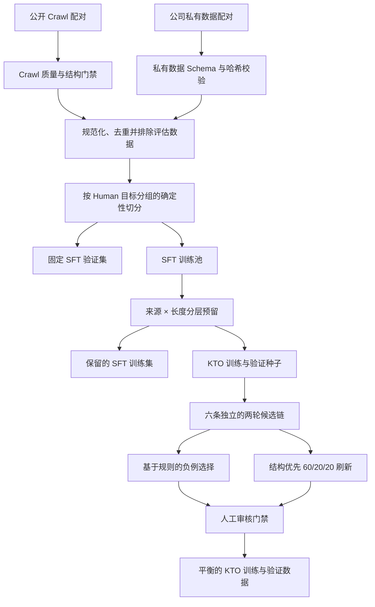

# Humanize KTO 数据构建流水线

[英文版](README.md)

Humanize KTO 数据构建流水线面向 AI-to-Human 改写任务，以确定性的方式构建 SFT 数据、预留互斥的 KTO 输入、生成改写候选、选择有效负例，并构建结构优先的 KTO 数据集。

仓库公开实现代码、策略配置、测试，以及**每个数据阶段严格 50 条 demo**。完整数据集、模型权重、私网地址和内部绝对路径均不包含在内。

训练数据主要有两个来源：公开的开源 Crawl 数据，以及公司的内部数据。对外产物只使用通用标签 `private` 指代内部来源，不披露内部数据集名称和完整内容。完整构造方法见 [docs/DATA_CONSTRUCTION.zh-CN.md](docs/DATA_CONSTRUCTION.zh-CN.md)。

## 流水线



核心约束如下：

- 预留给 KTO 的输入会从 SFT 训练集移除；
- 上游 SFT 验证集保持不变；
- source、target 和 pair 的身份通过 SHA-256 字段贯穿各阶段；
- 每个 KTO 输入对应一条 desirable 和一条 undesirable 记录；
- 生成负例必须通过显式机械规则，但最终仍需人工审核；
- 产物使用时间戳目录，并登记到 `manifest.yaml`。

完整数据方法见 [docs/DATA_CONSTRUCTION.zh-CN.md](docs/DATA_CONSTRUCTION.zh-CN.md)，阶段契约和设计说明见 [docs/ARCHITECTURE.zh-CN.md](docs/ARCHITECTURE.zh-CN.md)。

## Prompt 多样化

本项目允许公开 System Prompt。方法上不使用一条固定指令，而是先随机生成一组任务约束一致、表层措辞不同的 Prompt 候选。构建 SFT 数据集时，对每个 source-target 配对使用固定种子 `42` 伪随机抽取一个 Prompt，并将选中的 `system_prompt_id` 写入样本索引，从而保证随机分配可以复现。后续 KTO 阶段会保留这个 Prompt，不重新抽取。

这种受控变化的目标，是降低模型对单一指令措辞的依赖，提升面对等价 Prompt 表达时的泛化能力。变化的只有指令表层措辞；改写目标、信息保留规则、源文本、目标文本和数据切分均保持不变。

完整工作思路和 5 个代表性 System Prompt 示例见 [docs/PROMPTS.zh-CN.md](docs/PROMPTS.zh-CN.md)。各阶段的数据 demo 会保留样本原本随机抽取到的 Prompt，作为记录来源信息的一部分。

## 目录结构

```text
code/data_process/     按 a 到 f 排序的数据流水线
code/harness/          manifest 和公开 demo 校验器
code/tests/            选择、校验和指标相关单测
configs/               版本化的预留与负例选择策略
data/demos/             5 个公开阶段，每阶段严格 50 条 JSONL
docs/                   中英文数据、架构与 Prompt 方法说明
tools/                  仅维护者使用的限量 demo 导出工具
manifest.yaml           可复现性与产物元数据
Makefile                对外支持的统一运行入口
```

## 快速开始

建议使用 Python 3.12。核心流水线依赖 PyYAML 和 tqdm；远程候选生成另外需要 httpx 与 OpenAI Python 客户端。

```bash
conda create -n test python=3.12
conda run -n test pip install -r requirements.txt
make check
```

在当前源码工作区以外，也可以覆盖 Make 变量使用其他 Python 环境：

```bash
make check PYTHON=python
```

`make check` 会校验项目 manifest、强制每阶段 50 条的发布上限、复核 demo 哈希、要求公开 Prompt 示例恰好为 5 个且互不重复、拒绝未登记的额外 JSONL、检查中英文文档链接和 Mermaid 图，并执行全部单测。可用 `make help` 查看支持的命令。

## 公开 demo 数据

仓库包含 5 份按阶段对齐的 demo：

| 阶段 | 文件 | 条数 |
|---|---|---:|
| 保留的 SFT 数据 | `data/demos/01_sft/sft_train_demo.jsonl` | 50 |
| KTO 预留种子 | `data/demos/02_reservation/kto_seed_demo.jsonl` | 50 |
| 模型生成候选 | `data/demos/03_generation/kto_candidates_demo.jsonl` | 50 |
| 已选择 KTO 记录 | `data/demos/04_negative_selection/kto_train_demo.jsonl` | 50 |
| 结构优先 KTO 记录 | `data/demos/05_structure_refresh/kto_train_demo.jsonl` | 50 |

条数与 SHA-256 固定在 `data/demos/manifest.yaml` 中。完整数据被刻意排除；`.gitignore` 默认忽略 `data/*`，只放行 `data/demos/**`。Schema 和发布注意事项见 [data/README.zh-CN.md](data/README.zh-CN.md)。

## 复现完整流水线

完整流程需要用户自行提供 SFT bundle，其中包含 `train.jsonl`、`validation.jsonl` 和 `sample_index.jsonl`，并由上游 manifest 登记条数和哈希。先执行只读供给检查：

```bash
make reservation-inspect \
  SOURCE_MANIFEST=/path/to/source/manifest.yaml \
  SOURCE_BUNDLE=/path/to/source/bundle \
  SOURCE_ARTIFACT_ID=your-artifact-id
```

确认后构建互斥的 SFT/KTO 预留数据：

```bash
make reservation-build \
  SOURCE_MANIFEST=/path/to/source/manifest.yaml \
  SOURCE_BUNDLE=/path/to/source/bundle \
  SOURCE_ARTIFACT_ID=your-artifact-id
```

候选生成默认锁定。只有显式指定服务、模型、远程执行环境并授权请求时才会启动：

```bash
export OPENAI_API_KEY=replace_me
make kto-candidate-generate \
  RESERVATION_BUNDLE=/path/to/reservation_bundle \
  GENERATION_BASE_URL=https://your-endpoint.example/v1 \
  GENERATION_MODEL=your-model \
  EXECUTION_ENV=remote \
  ALLOW_REMOTE_MODEL_CALLS=1
```

该目标可能产生大量付费请求或资源消耗。启用前请检查 `make help`、所用配置、请求量与服务策略。执行 `make check` 不会加载模型，也不会进行推理或训练。

## 项目边界

本项目只负责数据构建与校验，不提供模型权重、训练启动器、推理服务、GPTZero 集成或效果承诺。机械选择得到的 KTO 数据，在审核样本通过人工验收前不应视为可训练数据。

## 许可证

代码使用 [MIT License](LICENSE)。demo 数据仅用于查看流水线格式；在正式发布或复用前，请再次确认源数据许可证、隐私要求与再分发权利。
