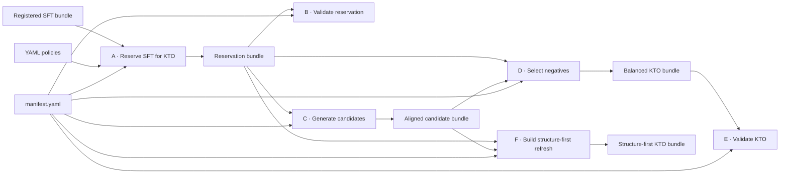
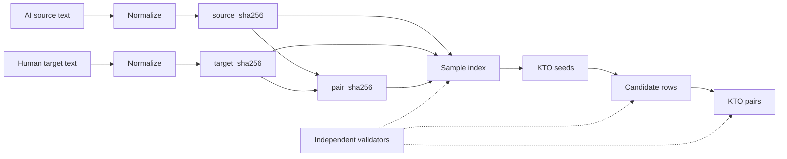

# Architecture

[Chinese](ARCHITECTURE.zh-CN.md)

The source-specific intake, merge, split, Prompt assignment, and KTO construction methodology is documented in [DATA_CONSTRUCTION.md](DATA_CONSTRUCTION.md).

## Stage contracts

| Stage | Module | Input | Output | Primary invariant |
|---|---|---|---|---|
| A. Reservation | `a_reserve_sft_for_kto.py` | SFT train, validation, sample index, reservation policy | retained SFT splits, KTO seeds, partition index | SFT and KTO inputs are disjoint; validation is unchanged |
| B. Reservation validation | `b_validate_sft_kto_reservation.py` | reservation bundle and upstream registration | validation report | counts, hashes, quotas, schemas, and disjointness match |
| C. Candidate generation | `c_generate_kto_candidates.py` | KTO seeds and explicit remote endpoint | aligned multi-round candidates | one deterministic identity record per input; resumable prefix only |
| D. Negative selection | `d_select_kto_negatives.py` | seeds, candidates, selector policy | balanced KTO rows, sample index, review sample | one positive and one mechanically supported negative per input |
| E. KTO validation | `e_validate_kto_dataset.py` | selected KTO bundle | validation report | labels, pair identities, negative types, counts, and hashes match |
| F. Structure refresh | `f_build_structure_first_kto_refresh.py` | seeds, six candidate chains, refresh policy | 60/20/20 KTO bundle | exact negative mixture and explicit fallback provenance |

## Design choices

- **Streaming JSONL**: dataset readers iterate line by line so memory use is bounded.
- **Stable selection**: seeded SHA-256 ordering provides reproducible sampling without depending on input loading order.
- **Versioned policy**: thresholds and quotas live in YAML instead of being hidden in recipes.
- **Controlled Prompt diversity**: wording variants are generated ahead of time and assigned per sample through seeded pseudo-random sampling; the task contract does not change.
- **Two-layer validation**: builders validate inputs while independent validators re-check output schemas, counts, identities, hashes, and manifest registration.
- **Human gate**: mechanical classification helps surface candidates; it does not replace semantic review.
- **Safe remote calls**: generation has no default endpoint and requires two explicit authorization flags.
- **Bounded release data**: `demo-validate` requires five known JSONL files, exactly 50 records each, and rejects extra files.

## Data identity

Records retain normalized SHA-256 identifiers for the AI source, human target, and source-target pair. Candidate and KTO stages verify these fields before joining records, avoiding positional joins that could silently mix examples.

## What remains external

Full source data, model weights, the OpenAI-compatible generation service, training infrastructure, and human-review decisions remain outside this repository. Their identities and parameters must be supplied explicitly for a full run.

The Prompt methodology and five public examples are documented in [PROMPTS.md](PROMPTS.md).
