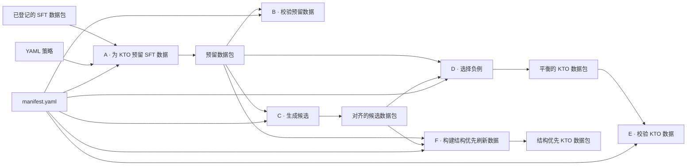
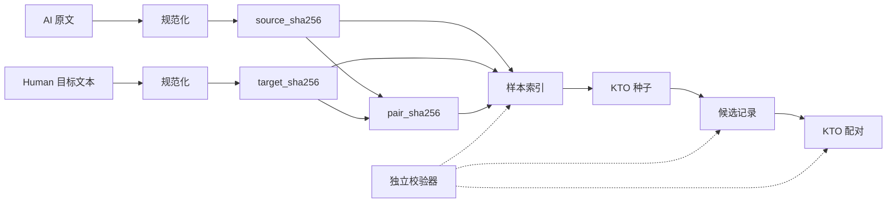

# 架构说明

[英文版](ARCHITECTURE.md)

不同来源的准入、合并、切分、Prompt 分配和 KTO 构造方法见 [DATA_CONSTRUCTION.zh-CN.md](DATA_CONSTRUCTION.zh-CN.md)。

## 阶段契约

| 阶段 | 模块 | 输入 | 输出 | 核心约束 |
|---|---|---|---|---|
| A. 数据预留 | `a_reserve_sft_for_kto.py` | SFT 训练集、验证集、样本索引、预留策略 | 保留的 SFT 数据、KTO 种子、分区索引 | SFT 与 KTO 输入互斥，验证集保持不变 |
| B. 预留校验 | `b_validate_sft_kto_reservation.py` | 预留数据包与上游登记信息 | 校验报告 | 条数、哈希、配额、Schema 和互斥关系一致 |
| C. 候选生成 | `c_generate_kto_candidates.py` | KTO 种子与显式远程服务 | 对齐的多轮候选 | 每个输入对应一条确定性身份记录，只允许按前缀断点续跑 |
| D. 负例选择 | `d_select_kto_negatives.py` | 种子、候选、选择策略 | 平衡的 KTO 数据、样本索引、审核样本 | 每个输入对应一个正例和一个有机械规则依据的负例 |
| E. KTO 校验 | `e_validate_kto_dataset.py` | 已选择的 KTO 数据包 | 校验报告 | 标签、配对身份、负例类型、条数和哈希一致 |
| F. 结构优先刷新 | `f_build_structure_first_kto_refresh.py` | 种子、六条候选链、刷新策略 | 60/20/20 KTO 数据包 | 负例比例精确，并显式记录兜底来源 |

## 设计取舍

- **流式 JSONL**：数据读取逐行进行，内存使用有明确上限。
- **稳定选择**：使用带种子的 SHA-256 排序实现可复现采样，不依赖数据加载顺序。
- **策略版本化**：阈值和配额保存在 YAML 中，不隐藏在 Make recipe 里。
- **受控 Prompt 多样化**：提前生成措辞不同的候选 Prompt，建集时通过带固定种子的伪随机采样为样本分配 Prompt，任务约束保持不变。
- **双层校验**：构建脚本校验输入，独立校验器再次检查输出 Schema、条数、身份、哈希和 manifest 登记。
- **人工门禁**：机械分类用于发现候选问题，不能替代语义审核。
- **安全远程调用**：候选生成不提供默认服务地址，并要求两个显式授权参数。
- **限量发布数据**：`demo-validate` 只允许 5 个已知 JSONL，每个文件严格 50 条，并拒绝额外文件。

## 数据身份

记录通过规范化文本的 SHA-256 标识 AI 原文、Human 目标文本及其配对关系。候选与 KTO 阶段在对齐前复核这些字段，避免仅靠行号关联导致静默错配。

## 外部依赖

完整源数据、模型权重、OpenAI-compatible 生成服务、训练基础设施与人工审核结论均不在仓库内。完整复现时必须显式提供这些对象及参数。

Prompt 方法和 5 个公开示例见 [PROMPTS.zh-CN.md](PROMPTS.zh-CN.md)。
