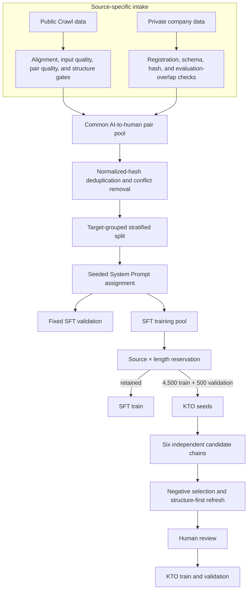
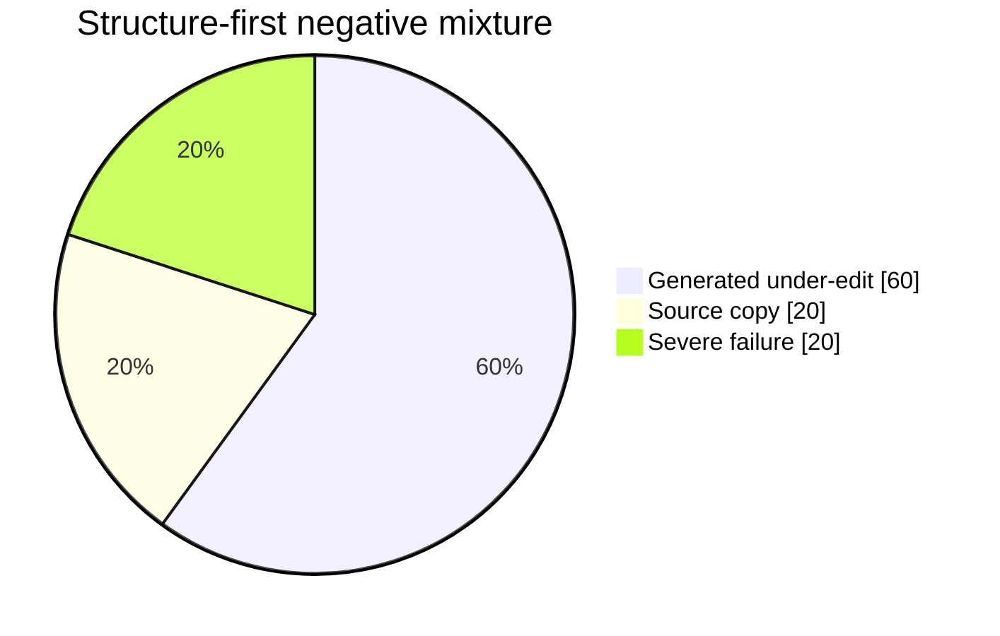
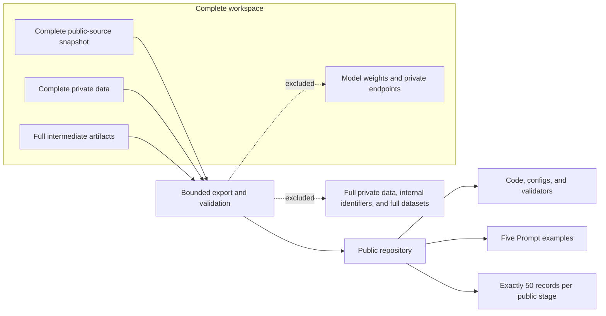

# Data construction

[Chinese](DATA_CONSTRUCTION.zh-CN.md)

## Data sources

The dataset combines two sources under a shared AI-to-human rewriting schema:

1. **Crawl data**: publicly available source data. It supplies broad topic, style, and length coverage. Users reproducing the pipeline must verify and comply with the license of their chosen public source.
2. **Private data**: internal company data. It supplies quality-reviewed AI-to-human rewrite pairs but is not distributed by this repository. Public artifacts use only the generic source label `private`; internal dataset names and source-specific identifiers are excluded.

The public demos are a bounded view of the resulting pipeline artifacts, not a release of either complete source dataset.

## Construction flow

### 1. Normalize both sources to one pair contract

Each candidate is represented as an AI-written source text and a human-written target text. Text is normalized for identity checks, while the original content is preserved for training. SHA-256 identifiers are recorded for the source, target, and pair.

### 2. Apply source-specific intake rules

Public Crawl records are aligned with their corresponding AI versions, checked for input and pair quality, and measured for meaningful structural change. A Crawl pair enters the SFT pool only when it passes the quality gates and the configured structure rule. Valid inputs that are unsuitable as SFT positives may be routed to preference-data preparation instead of being silently discarded.

Private records arrive as registered, quality-reviewed AI-to-human pairs. They are schema- and hash-validated, checked against excluded evaluation inputs, and then admitted to the common SFT candidate pool. The private source is never published in full.

### 3. Prevent leakage and identity conflicts

The merged pool is checked before splitting:

- external evaluation inputs are excluded;
- duplicate pairs are collapsed by normalized hashes;
- an AI input mapped to conflicting human targets is removed;
- preference candidates that overlap any SFT input are removed;
- later KTO reservations are removed from the retained SFT training split.

### 4. Build deterministic train and validation splits

Records sharing the same human target hash remain in the same split. Target groups are stratified by source type, edit-distance bucket, and length bucket, then assigned by a seeded deterministic ranking. This avoids target leakage while keeping the public and private source distributions represented.

### 5. Sample diverse System Prompts

A pool of randomized Prompt wording variants is generated before dataset construction. For every source-target pair, one Prompt is pseudo-randomly sampled with fixed seed `42`; its `system_prompt_id` is stored in the sample index. The wording varies, while the rewriting task and all other sample fields remain unchanged. See [PROMPTS.md](PROMPTS.md).

### 6. Reserve a disjoint KTO pool

The pipeline reserves 5,000 inputs from SFT training using source and length strata: 3,500 Crawl inputs and 1,500 private inputs. The reserved set is split deterministically into 4,500 KTO-train and 500 KTO-validation seeds, and those inputs are removed from the retained SFT training data.

### 7. Generate and select KTO responses

Each reserved input is passed through independent two-round candidate chains at temperatures `0.3`, `0.5`, `0.7`, `0.9`, `1.0`, and a second independent `1.0` chain. Identity hashes keep every result aligned with its seed.

The original human rewrite is the desirable response. Undesirable responses are selected through explicit gates for under-editing, structural damage, semantic drift, over-rewriting, repetition, refusal, and related failure signals. The structure-first refresh uses an exact 60% generated-under-edit, 20% source-copy, and 20% severe-failure negative mix. Mechanical selection never replaces human review.

### 8. Record provenance and validate independently

Each run writes timestamped artifacts, counts, parameters, and SHA-256 hashes. Independent validators re-check schemas, alignment, split disjointness, label balance, mixture counts, file hashes, and manifest registration.

## Public-release boundary

The repository publishes implementation code, policies, validators, five Prompt examples, and exactly 50 JSONL records for each public stage. It does not publish complete public-source snapshots, complete private data, model weights, private endpoints, or internal source identifiers.

