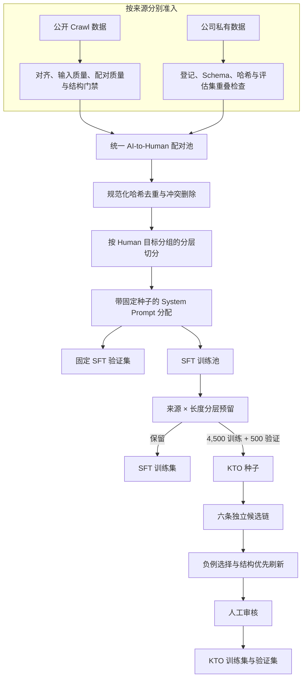
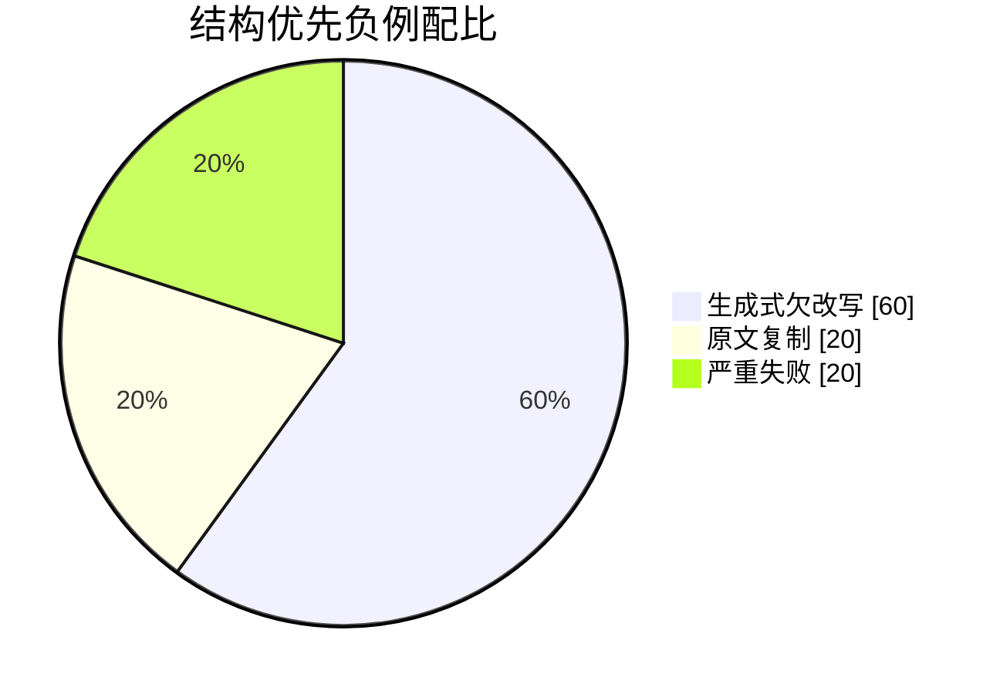
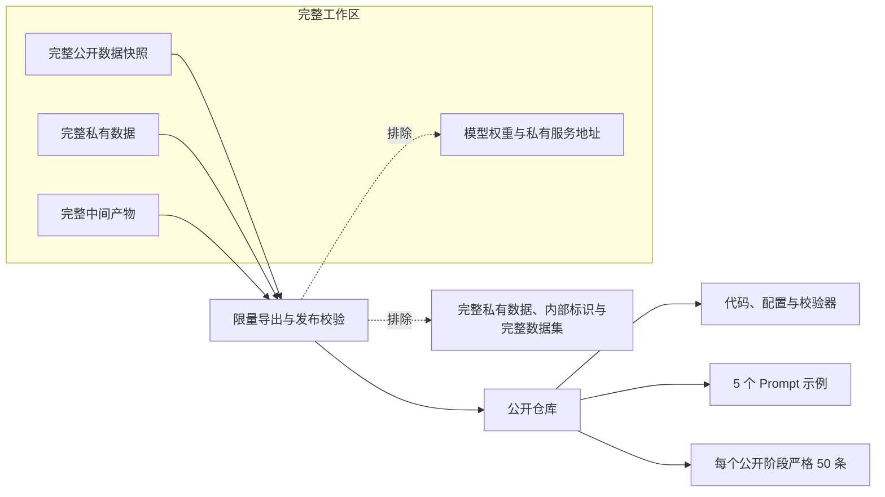

# 数据构造方法

[英文版](DATA_CONSTRUCTION.md)

## 数据来源

数据集采用统一的 AI-to-Human 改写 Schema，组合两个来源：

1. **Crawl 数据**：公开的开源数据，用于覆盖更广泛的主题、文体和长度。复现项目时，使用者仍需确认并遵守具体公开数据源的许可证。
2. **私有数据**：公司的内部数据，提供经过质量审核的 AI-to-Human 改写配对，但不会随本仓库分发。公开产物统一使用通用来源标签 `private`，不披露内部数据集名称和来源特有标识。

公开 demo 只是流水线阶段产物的限量展示，不代表对任一完整源数据集的公开发布。

## 构造流程

### 1. 将两种来源统一成配对 Schema

每条候选数据都由 AI 原文和 Human 目标文本组成。文本会进行规范化以完成身份校验，但训练时仍保留原始内容。流水线分别记录 source、target 和 pair 的 SHA-256。

### 2. 按来源应用不同的准入规则

Crawl 记录会先与对应的 AI 版本对齐，再检查输入质量、配对质量和结构变化。只有同时通过质量门禁和配置中结构规则的 Crawl 配对，才会进入 SFT 候选池。输入本身有效、但不适合作为 SFT 正例的记录，可以转入偏好数据准备阶段，而不是直接静默丢弃。

私有数据以已登记、经过质量审核的 AI-to-Human 配对形式进入流程。流水线会复核 Schema 和哈希，排除与评估集重叠的输入，再将其加入统一的 SFT 候选池。私有数据不会完整公开。

### 3. 防止泄漏和身份冲突

两种来源合并后、切分前，会执行以下检查：

- 排除外部评估集中的输入；
- 根据规范化哈希合并重复配对；
- 删除同一个 AI 输入对应多个冲突 Human 目标的记录；
- 删除与任一 SFT 输入重叠的偏好候选；
- 后续预留给 KTO 的输入会从保留的 SFT 训练集中移除。

### 4. 确定性构建训练集和验证集

具有相同 Human 目标哈希的记录必须进入同一个 split。目标分组按来源类型、编辑距离区间和长度区间分层，再通过带固定种子的确定性排序完成分配。这样既能避免目标泄漏，也能让 Crawl 与私有来源在切分中保持覆盖。

### 5. 随机采样多样化 System Prompt

构建数据集之前，先生成一组措辞不同的随机 Prompt 候选。对每个 source-target 配对，使用固定种子 `42` 伪随机抽取一个 Prompt，并将 `system_prompt_id` 写入样本索引。变化的只有指令措辞，改写任务和其他样本字段保持不变。详见 [PROMPTS.zh-CN.md](PROMPTS.zh-CN.md)。

### 6. 预留互斥的 KTO 数据池

流水线按照来源和长度分层，从 SFT 训练池预留 5,000 个输入，其中 Crawl 3,500 个、私有数据 1,500 个。预留集合再确定性切分为 4,500 个 KTO-train seed 和 500 个 KTO-validation seed；这些输入会从保留的 SFT 训练数据中移除。

### 7. 生成并选择 KTO 响应

每个预留输入分别经过六条独立的两轮候选链，温度为 `0.3`、`0.5`、`0.7`、`0.9`、`1.0` 和另一条独立的 `1.0`。身份哈希保证所有候选始终与对应 seed 对齐。

原始 Human 改写作为 desirable response。undesirable response 根据欠改写、结构破坏、语义偏移、过度改写、重复、拒答等显式规则选择。结构优先刷新阶段使用精确的负例比例：60% 生成式欠改写、20% 原文复制、20% 严重失败。机械选择不能替代人工审核。

### 8. 记录来源并独立校验

每次运行都会记录带时间戳的产物、条数、参数和 SHA-256。独立校验器会再次检查 Schema、样本对齐、split 互斥、标签平衡、负例比例、文件哈希和 manifest 登记。

## 对外发布边界

仓库公开实现代码、策略、校验器、5 个 Prompt 示例，以及每个公开阶段严格 50 条 JSONL。仓库不公开完整的 Crawl 源数据快照、完整私有数据、模型权重、私有服务地址或内部来源标识。

