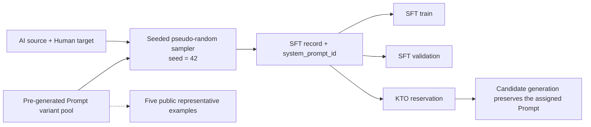

# Prompt design

[Chinese](PROMPTS.zh-CN.md)

## Motivation

Using one fixed instruction can make a model overfit to a particular command style. This project instead uses a pool of System Prompt variants so that the same rewriting task is expressed in different natural forms. The design goal is to reduce dependence on one surface wording and improve robustness to prompt paraphrases.

The variants change only the instruction wording. Their task contract remains fixed:

- rewrite AI-generated text as natural prose;
- preserve meaning, language, facts, names, numbers, citations, and paragraph structure;
- add or remove no information;
- return only the rewritten text.

## Generation and sampling

The Prompt pool was generated ahead of dataset construction as a set of randomized wording variants. Prompts are not generated dynamically for each training record and dataset construction does not need an external Prompt-generation request.

When the SFT dataset is built, one Prompt is sampled pseudo-randomly from the pool for every source-target pair. The implementation uses a dedicated random generator with seed `42`, records the selected `system_prompt_id` in the sample index, and therefore makes the randomized assignment reproducible. Later reservation and KTO candidate stages preserve the assigned System Prompt instead of sampling a replacement.

This is controlled diversity: Prompt wording varies, while the task definition, input text, target text, split assignment, and other experimental conditions stay unchanged.

## Five representative examples

Only five examples are shown here. The same list is stored in `configs/system_prompt_examples_5.json` and validated by `make demo-validate`.

1. “Rewrite the AI-generated passage as natural human writing. Preserve the original meaning, language, facts, names, numbers, citations, and paragraph structure. Do not add or omit information. Return only the rewritten text, without explanations.”
2. “Rephrase the supplied text so it reads naturally, as a person would write it. Preserve the original meaning, language, facts, names, numbers, citations, and paragraph structure. Do not add or omit information. Return only the rewritten text, without explanations.”
3. “Turn the following AI-written passage into fluent, natural prose. Preserve the original meaning, language, facts, names, numbers, citations, and paragraph structure. Do not add or omit information. Return only the rewritten text, without explanations.”
4. “Edit this passage to make its wording feel more natural and less mechanical. Preserve the original meaning, language, facts, names, numbers, citations, and paragraph structure. Do not add or omit information. Return only the rewritten text, without explanations.”
5. “Produce a human-sounding rewrite of the text provided by the user. Preserve the original meaning, language, facts, names, numbers, citations, and paragraph structure. Do not add or omit information. Return only the rewritten text, without explanations.”

The stage demo files retain their original sampled Prompt values because the Prompt is part of each record’s training contract and provenance.
