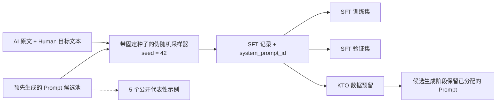

# Prompt 设计

[英文版](PROMPTS.md)

## 设计动机

只使用一条固定指令，模型可能会依赖某一种命令表达。这个项目使用多种 System Prompt 组成候选池，用不同的自然措辞表达同一个改写任务。设计目标是降低模型对单一表层措辞的依赖，并提高面对 Prompt 同义改写时的稳健性和泛化能力。

不同 Prompt 只改变指令措辞，任务约束始终保持一致：

- 将 AI 生成文本改写成自然语言；
- 保留原意、语言、事实、名称、数字、引用和段落结构；
- 不增加或删除信息；
- 只返回改写后的文本。

## 生成与采样

Prompt 候选池在构建数据集之前预先随机生成，由多种不同措辞组成。它不是在处理每条训练记录时动态生成的，因此建集过程不需要额外调用外部 Prompt 生成服务。

构建 SFT 数据集时，每个 source-target 配对都会从候选池中伪随机抽取一个 Prompt。实现使用独立随机生成器和固定种子 `42`，并将选中的 `system_prompt_id` 写入样本索引，因此随机分配过程可以复现。后续的数据预留和 KTO 候选生成阶段会保留已经分配的 System Prompt，不会重新抽取。

这是一种受控多样化：Prompt 的表层措辞发生变化，但任务定义、输入文本、目标文本、数据切分和其他实验条件保持不变。

## 五个代表性示例

这里只展示 5 个示例。同一份列表保存在 `configs/system_prompt_examples_5.json` 中，并由 `make demo-validate` 校验。

1. “Rewrite the AI-generated passage as natural human writing. Preserve the original meaning, language, facts, names, numbers, citations, and paragraph structure. Do not add or omit information. Return only the rewritten text, without explanations.”
2. “Rephrase the supplied text so it reads naturally, as a person would write it. Preserve the original meaning, language, facts, names, numbers, citations, and paragraph structure. Do not add or omit information. Return only the rewritten text, without explanations.”
3. “Turn the following AI-written passage into fluent, natural prose. Preserve the original meaning, language, facts, names, numbers, citations, and paragraph structure. Do not add or omit information. Return only the rewritten text, without explanations.”
4. “Edit this passage to make its wording feel more natural and less mechanical. Preserve the original meaning, language, facts, names, numbers, citations, and paragraph structure. Do not add or omit information. Return only the rewritten text, without explanations.”
5. “Produce a human-sounding rewrite of the text provided by the user. Preserve the original meaning, language, facts, names, numbers, citations, and paragraph structure. Do not add or omit information. Return only the rewritten text, without explanations.”

各阶段的数据 demo 会保留样本原本随机分配到的 Prompt，因为 Prompt 是训练记录契约和数据来源信息的一部分。
